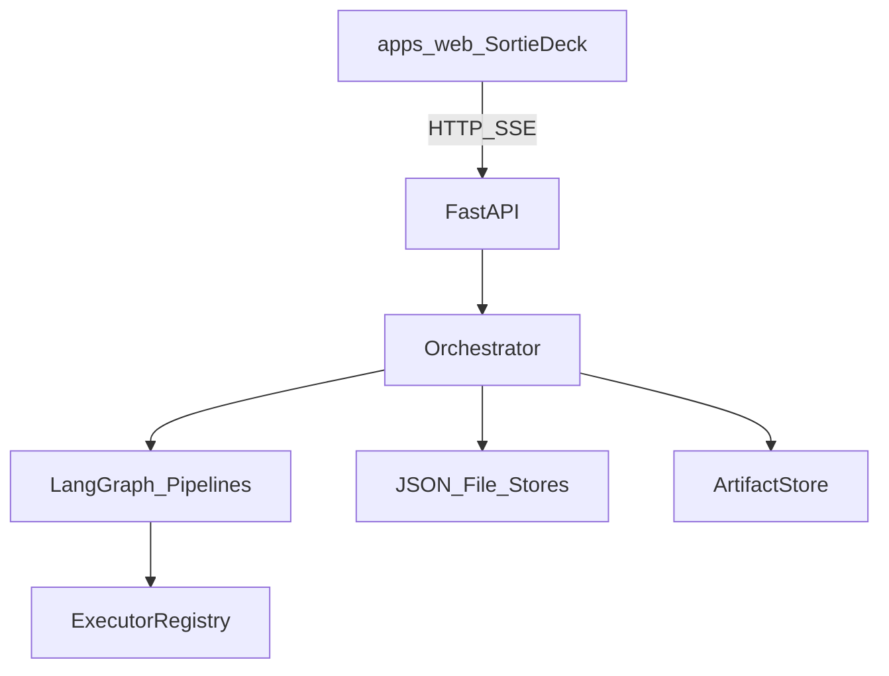

# Sortie Deck

[](LICENSE)
[](https://www.python.org/)
[](#documentation)

**English** | [简体中文](README.zh-CN.md)

**Sortie Deck** (PyPI / import: `sortie-deck` / `sortie_deck`) is an **AI-native office iteration control plane**.

It assembles role agents for each mission, orchestrates delivery with **LangGraph**, keeps humans in the loop at clearance gates, and hands artifacts between stages by **contract** — so Product → Eng → QA → Deploy does not rely on human copy-paste relays.

The workbench provides a mission board, squad chat rooms, Codex knowledge, memory, agent forge, and a toolkit (Tools · MCP · Skills).

## Why Sortie Deck

- **Control plane, not another chatbot** — missions, stages, HITL, and artifacts are first-class.
- **Pluggable executors** — `mock`, `claude_code`, `cursor_cli`, `deploy_shell`, optional LLM product.
- **Confirmable pipelines** — an internal **pipeline planner** proposes stages from the brief; humans confirm or edit before launch.
- **Composable loadout** — published agents, role toolkits, and memory compound across missions.

## Features

| Area | Capability |
|------|------------|
| Auth & RBAC | Login sessions, admin / member roles, user admin |
| Missions | Create / list / start / stop / HITL / SSE progress |
| Pipeline planner | Express / standard / default tracks; propose → confirm → manual add/remove/reorder |
| Graph & HITL | Template-driven LangGraph; approve / reject / rewrite / stop |
| Squad rooms | Join, chat, `@product` / `@eng` / …, slash commands |
| Knowledge (Codex) | Playbooks and reusable field intel |
| Memory | Workspace / user / mission / agent scopes |
| Agent forge | Publish specialist personas + default toolkits |
| Toolkit | Tools, MCP, Skills (+ import scripts) |
| Workbench | React + TypeScript, CN/EN UI, themes |
| CLI | `sortie smoke`, `sortie api` |

## Architecture (overview)



Full design, module specs, and roadmaps: see [Documentation](#documentation).

## Quick start

```bash
git clone <repo-url> Truested-Dev-Teams
cd Truested-Dev-Teams
python3 -m venv .venv
source .venv/bin/activate   # Windows: .venv\Scripts\activate
pip install -e ".[dev]"

# Smoke CLI (auto-confirms pipeline, drives HITL)
sortie smoke --help
sortie smoke

# API
sortie api --help
sortie api
# → http://127.0.0.1:8787/api/health

# Workbench
cd apps/web && npm install && npm run dev
# → http://127.0.0.1:5173
```

Default logins (dev seeds): `admin` / `admin123`, `operator` / `operator123`.

### Coding executors (Claude Code & Cursor CLI)

Eng stages can call real coding CLIs when registered in the pipeline (`claude_code`, `cursor_cli`). If the binary is missing, the stage **soft-fails** with an actionable message (no silent mock scaffold).

**Claude Code**

```bash
# Install: https://docs.anthropic.com/en/docs/claude-code
npm install -g @anthropic-ai/claude-code   # or follow Anthropic install docs
export ANTHROPIC_API_KEY=sk-ant-...        # required for Claude Code
claude --version
```

**Cursor Agent CLI**

```bash
# Install Cursor CLI / agent binary (see Cursor docs for your OS)
cursor-agent --version   # or `agent --version` on PATH
```

Optional env (same `TDT_` prefix as the API):

| Variable | Purpose |
|----------|---------|
| `ANTHROPIC_API_KEY` | Claude Code auth |
| `CURSOR_API_KEY` | Cursor CLI auth (when required by your install) |

Worktrees land under `data/worktrees/<initiative_id>/` (git worktree when the repo is a git checkout).

### Toolkit examples & binding

Import-ready samples live under `packages/examples/` (`demo-mcp.json`, `demo-skill/SKILL.md`). In the workbench **Toolkit** page, import MCP JSON or skill markdown/zip, then bind item ids on **Agent Forge** (default `toolkit_ids`) or per-mission **role/stage toolkits**. Disabled toolkit items are omitted from persona briefs.

### Squad commands

`/confirm` · `/start` · `/approve` · `/reject` · `/rewrite …` · `/stop`

Mentions: `@product` `@eng` `@qa` `@deploy`

## Configuration

Environment variables use prefix `TDT_` (see `sortie_deck.settings.Settings`).

| Variable | Description |
|----------|-------------|
| `TDT_HOST` / `TDT_PORT` | API bind (default `127.0.0.1:8787`) |
| `TDT_CORS_ORIGINS` | Comma-separated origins for the workbench |
| `TDT_ENV` | `development` (default) or `production` |
| `TDT_TOKEN_SECRET` | HMAC secret for auth tokens (required non-default when `TDT_ENV=production`) |
| `TDT_STORAGE` | `json` (default) or `sqlite` for initiative persistence |
| `TDT_RUN_BACKEND` | `inline` (default) or `sqlite` multi-worker run queue |
| `TDT_ARTIFACT_BACKEND` | `local` (default) or `s3` (needs `pip install '.[s3]'`) |
| `TDT_ORG_POLICY_PATH` | Optional JSON org policy (tracks / toolkit allowlist) |
| `TDT_PIPELINE_LLM` / `TDT_ROOM_LLM` | Optional LLM planner / squad discussion (`true` + API key) |
| `TDT_MCP_RUNTIME` | Wire MCP toolkit tools into coding executor prompts |
| `TDT_LLM_API_KEY` / `OPENAI_API_KEY` | OpenAI-compatible key for planner / rooms / product LLM |
| `TDT_SLACK_SIGNING_SECRET` / `TDT_FEISHU_VERIFICATION_TOKEN` | Chat bridge verification |
| `TDT_DEPLOY_EXECUTOR` | `mock` (default) or `deploy_shell` |
| `TDT_DEPLOY_CMD` | Shell template for deploy (`{initiative_id}`, `{artifact_dir}`, `{workspace_dir}`) |
| `TDT_POSTGRES_URI` | Optional Postgres checkpointer |
| `TDT_ENG_CONCURRENCY` | Eng stage concurrency (default `3`) |
| `OPENAI_API_KEY` / `TDT_LLM_*` | Optional LLM product executor |

## Pipelines & HITL

Tracks (YAML under `packages/templates/`):

| Track | Typical use | Nodes (summary) |
|-------|-------------|-----------------|
| **express** | Hotfix / one-liner | Intake → build → QA → ship |
| **standard** | Normal feature | PRD → cases → build → self-test → integrate → handoff → QA → ship |
| **default** | Office iteration | PRD → build → QA → ship |

On create, the **pipeline planner** proposes stages. Confirm (UI or `/confirm`) before `/start`. Edit stages (add / remove / reorder / HITL toggles) while draft.

QA failure after approve can **loop back** to `eng_implement`. HITL actions: `approve` · `reject` · `edit_instruction` · `stop` · `reroute`.

## Repository layout

```
src/sortie_deck/   # Control plane, API, plugins, stores
packages/templates/      # Pipeline YAML + personas
packages/examples/       # Sample toolkit MCP + skill imports
apps/web/                # Sortie Deck workbench
data/artifacts/          # Stage artifacts: <initiative>/<stage>/ (runtime)
docs/en/  docs/zh/       # MkDocs bilingual site
tests/                   # Integration & unit tests
```

Stage outputs are written to `data/artifacts/<initiative_id>/<stage>/` (see [artifacts module](docs/en/modules/artifacts.md)).

## Documentation

Bilingual docs site (language switcher in the theme):

```bash
pip install -e ".[docs]"
mkdocs serve
# → http://127.0.0.1:8000
```

- English: `docs/en/`
- 简体中文: `docs/zh/`

Also: [CONTRIBUTING](CONTRIBUTING.md) · [SECURITY](SECURITY.md) · [CODE OF CONDUCT](CODE_OF_CONDUCT.md) · [CHANGELOG](CHANGELOG.md)

## Contributing

See [CONTRIBUTING.md](CONTRIBUTING.md). Issues and PRs are welcome.

## Security

Please report vulnerabilities per [SECURITY.md](SECURITY.md). Do not open public issues for sensitive reports.

## License

Copyright 2026 Sortie Deck contributors.

Licensed under the [Apache License, Version 2.0](LICENSE).

## 后续规划

下一阶段能力 backlog 见 [TODO.md](./TODO.md)。
