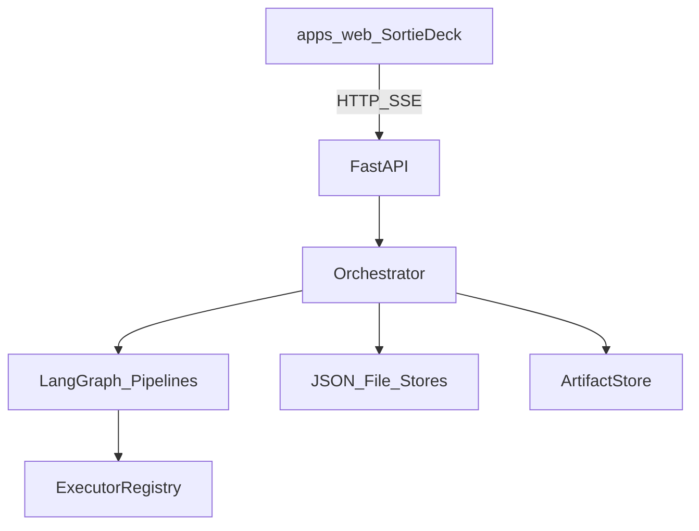

# Sortie Deck

[](LICENSE)
[](https://www.python.org/)
[](#文档)

[English](README.md) | **简体中文**

**Sortie Deck**（PyPI / import：`sortie-deck` / `sortie_deck`）是 **AI Native 办公迭代控制面**。

按任务集结角色 Agent，用 **LangGraph** 编排交付，在门禁阶段保留真人确认，产物按 **契约** 流转——产品 → 工程 → 测试 → 发布，不再依赖「传话筒」式人工誊写。

工作台提供任务板、小队频道、Codex 知识库、记忆、角色工坊与工具箱（Tools · MCP · Skills）。

## 为什么是 Sortie Deck

- **控制面，而不是又一个聊天框** — 任务、阶段、HITL、产物一等公民。
- **可插拔执行器** — `mock` / `claude_code` / `cursor_cli` / `deploy_shell`，可选 LLM 产品位。
- **可确认航线** — 内部 **航线规划官** 根据简报提案节点；出击前需确认或手改。
- **可组合编制** — 已发布角色、编制位工具包、记忆跨任务复利。

## 功能一览

| 领域 | 能力 |
|------|------|
| 登录与权限 | Session 登录、admin / member、用户管理 |
| 任务 | 创建 / 列表 / 出击 / 停止 / HITL / SSE 进度 |
| 航线规划 | 快轨 / 标准轨 / 默认轨；提案 → 确认 → 手动增删改 |
| 图与门禁 | 模板驱动 LangGraph；放行 / 打回 / 改写 / 停止 |
| 小队频道 | 加入、讨论、`@` 点名、斜杠命令 |
| 知识库 Codex | 作战手册与可复用前线情报 |
| 记忆 | 工作区 / 用户 / 任务 / Agent 作用域 |
| 角色工坊 | 发布人设 + 默认工具包 |
| 工具箱 | Tools、MCP、Skills（含导入） |
| 工作台 | React + TypeScript，中英 UI，主题 |
| CLI | `sortie smoke`、`sortie api` |

## 架构速览



完整设计、模块技术方案与实现计划见 [文档](#文档)。

## 快速开始

```bash
git clone <repo-url> Truested-Dev-Teams
cd Truested-Dev-Teams
python3 -m venv .venv
source .venv/bin/activate   # Windows: .venv\Scripts\activate
pip install -e ".[dev]"

# CLI 冒烟（自动确认航线并走过 HITL）
sortie smoke

# API
sortie api
# → http://127.0.0.1:8787/api/health

# 工作台
cd apps/web && npm install && npm run dev
# → http://127.0.0.1:5173
```

默认账号（开发种子）：`admin` / `admin123`，`operator` / `operator123`。

### 编码执行器（Claude Code / Cursor CLI）

工程阶段可选用 `claude_code`、`cursor_cli` 执行器。若本机未安装对应 CLI，阶段会**软失败**并返回可操作的错误信息（不会静默写 mock 脚手架）。

**Claude Code**

```bash
# 安装：https://docs.anthropic.com/en/docs/claude-code
npm install -g @anthropic-ai/claude-code
export ANTHROPIC_API_KEY=sk-ant-...
claude --version
```

**Cursor Agent CLI**

```bash
cursor-agent --version   # 或 PATH 上的 `agent`
```

| 变量 | 用途 |
|------|------|
| `ANTHROPIC_API_KEY` | Claude Code 鉴权 |
| `CURSOR_API_KEY` | Cursor CLI（视安装方式而定） |

工作区目录：`data/worktrees/<initiative_id>/`（git 仓库时优先 git worktree）。

### 工具箱示例与绑定

可导入示例位于 `packages/examples/`（`demo-mcp.json`、`demo-skill/SKILL.md`）。在工作台 **工具箱** 页导入后，在 **Agent 工坊** 绑定默认 `toolkit_ids`，或在任务上覆盖 **role/stage toolkits**。已停用的工具项不会进入 persona brief。

### 小队命令

`/confirm` · `/start` · `/approve` · `/reject` · `/rewrite …` · `/stop`

点名：`@product` `@eng` `@qa` `@deploy`

## 配置

环境变量前缀 `TDT_`（见 `sortie_deck.settings.Settings`）。

| 变量 | 说明 |
|------|------|
| `TDT_HOST` / `TDT_PORT` | API 监听（默认 `127.0.0.1:8787`） |
| `TDT_CORS_ORIGINS` | 工作台 CORS，逗号分隔 |
| `TDT_DEPLOY_EXECUTOR` | `mock`（默认）或 `deploy_shell` |
| `TDT_DEPLOY_CMD` | 部署 shell 模板（`{initiative_id}` 等） |
| `TDT_POSTGRES_URI` | 可选 Postgres checkpointer |
| `TDT_ENG_CONCURRENCY` | 工程阶段并发（默认 `3`） |
| `OPENAI_API_KEY` / `TDT_LLM_*` | 可选 LLM 产品执行器 |

## 航线与 HITL

模板位于 `packages/templates/`：

| 航线 | 适用 | 节点概要 |
|------|------|----------|
| **express** | 热修 / 一行改动 | 集结 → 开发 → 测试 → 发布 |
| **standard** | 正常需求 | PRD → 用例 → 开发 → 自测 → 联调 → 提测 → 测试 → 上线 |
| **default** | 办公迭代 | PRD → 开发 → 测试 → 发布 |

创建任务后由 **航线规划官** 提案；确认（UI 或 `/confirm`）后才可 `/start`。草稿期可增删、重排节点并开关门禁。

QA 未通过且批准后可 **回环** 到 `eng_implement`。HITL：`approve` · `reject` · `edit_instruction` · `stop` · `reroute`。

## 目录结构

```
src/sortie_deck/   # 控制面、API、插件、存储
packages/templates/      # 航线 YAML + 人设
packages/examples/       # 工具箱 MCP / Skill 导入示例
apps/web/                # Sortie Deck 工作台
data/artifacts/          # 阶段产物：<initiative>/<stage>/（运行时）
docs/en/  docs/zh/       # MkDocs 双语站点
tests/                   # 测试
```

阶段产物写入 `data/artifacts/<initiative_id>/<stage>/`（见 [产物模块](docs/zh/modules/artifacts.md)）。

## 文档

双语文档站（主题内语言切换）：

```bash
pip install -e ".[docs]"
mkdocs serve
# → http://127.0.0.1:8000
```

- English: `docs/en/`
- 简体中文: `docs/zh/`

另见：[贡献指南](CONTRIBUTING.md) · [安全](SECURITY.md) · [行为准则](CODE_OF_CONDUCT.md) · [变更日志](CHANGELOG.md)

## 贡献

见 [CONTRIBUTING.md](CONTRIBUTING.md)。欢迎 Issue 与 PR。

## 安全

按 [SECURITY.md](SECURITY.md) 披露漏洞，请勿在公开 Issue 中发送敏感细节。

## 许可证

Copyright 2026 Sortie Deck contributors.

基于 [Apache License, Version 2.0](LICENSE) 授权。
