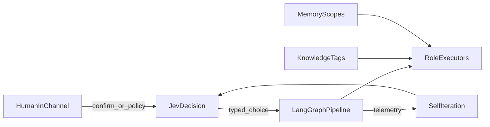

# Sortie Deck 后续能力 TODO

> 状态：规划草案（非实现规格）。Jev 接入目前为**设想**，落地前需 API 契约、置信度阈值与人工兜底。  
> 对照实现仓：Sortie Deck（LangGraph 流水线、小队频道、WeKnora 知识目录、记忆 JSON 等）。

---

## 1. 真人频道与角色绑定

### 背景

小队频道今天以 Agent 阶段消息、HITL 决策、@ 协商为主。登录用户应能在频道里以**真人身份发言**，并绑定任务小队中的角色，形成「人在环」的日常沟通，而不只是点批准。

### 目标约束

- 登录用户可在当前任务小队频道发言（文本进入房间时间线，与 Agent 消息同流）。
- **一人可关联多个角色**（例如同一运营兼产品确认）。
- **一个角色只能被一个真人关联**（排他占用；解绑后可转交）。
- **AI 沟通与回复默认需真人确认**，或由真人配置管控档位（对齐 Claude Code / 编码执行器的 permission mode，例如 `acceptEdits`、编辑时确认、绕过等）。
- 真人可绑定 **钉钉 / 飞书** 等 IM：
  - 在 Sortie **个人通知**内确认（HITL、待回复、权限升级）；
  - 或在钉钉/飞书侧展示小队频道群聊镜像（读/写策略需单独定）。

### 技术方案要点

- 数据：`user_id ↔ initiative_id ↔ role_slot` 绑定表；唯一约束 `(initiative_id, role_slot)`。
- 发言：`RoomMessage.actor_kind=human`，带 `user_id` 与可选 `bound_role`。
- Agent 出站：`needs_human_confirm` 门禁；档位来自用户/任务设置，复用现有 coding permission 语义并扩展到「频道回复」。
- 桥：在现有 `/api/bridges/slack` · `/api/bridges/feishu` 思路上补钉钉，以及「通知确认」vs「群镜像」两条通道。

### 建议里程碑

| 阶段 | 内容 | 验收 |
|------|------|------|
| P0 | 绑定模型 + 频道真人发言 | 一角一人；消息可见 |
| P1 | AI 回复确认 / 权限档 | 未确认不出站；档位可配 |
| P2 | 钉钉/飞书通知 + 群镜像 | 通知可确认；镜像只读或受控写 |

### 开放问题

- 群镜像写回是否允许 IM 侧任意成员发言，还是仅绑定用户。
- 角色转交时进行中的 HITL 如何跟随。

---

## 2. 知识库（目录 / worktree + 标签）

### 背景

现有知识是 catalog + 可选 WeKnora 检索，任务 pack 给 Cursor。需要 **目录/worktree 心智**，并用标签区分作用域，避免全局与任务知识混用。

### 目标约束

- 管理界面呈 **目录树或 worktree**（文件夹、文件、同步状态），而不仅是扁平列表。
- 能区分：**全局**、**某业务/项目**、**某任务**。
- 知识条目带 **标签**（作用域标签 + 主题标签），检索与 pack 按标签过滤。

### 技术方案要点

- 作用域：`scope=workspace | business | mission` + `scope_id`。
- 目录：沿用 `folder_path`；可选把任务知识镜像到 `data/worktrees/{ini}/knowledge/` 或独立 `knowledge-trees/`。
- 检索：WeKnora 侧按 metadata 过滤；本地 catalog 同步标签。
- Pack：只注入当前任务标签 ∪ 显式挂载的业务/全局包。

### 建议里程碑

| 阶段 | 内容 | 验收 |
|------|------|------|
| P0 | 作用域 + 标签模型与 UI 过滤 | 任务知识不会误注入其它任务 |
| P1 | 目录树管理 / 导入进文件夹 | 可浏览层级 |
| P2 | 任务 worktree 镜像 + 与 WeKnora 双向 sync | 本地树与远端一致 |

### 开放问题

- 业务（business）是否等于「多任务共享的项目空间」，还是独立租户字段。

---

## 3. 记忆管理（分层 + 双存储）

### 背景

现有记忆已有 `workspace / user / mission / agent` 与 `fact / preference / episode / lesson`。需要更清晰的产品分层，并同时支持 **文件式记忆**（如 PageIndex 类目录）与 **向量化记忆**。

### 目标约束

分层至少包括：

| 层 | 含义 |
|----|------|
| 全局约定 | 团队/工作区不可轻易覆盖的规范 |
| 项目记忆 | 业务线长期事实与偏好 |
| 任务记忆 | 本出击过程事实、决议、战例 |
| 成员个人记忆 | 真人用户偏好 |
| 角色/经验沉淀 | Agent 或岗位的 lesson |

存储：

- **文件式**：可版本、可审阅（PageIndex / Markdown 树）。
- **向量化**：语义召回；写入前分类。
- 分类继续用 kind，并允许自定义 taxonomy。

### 技术方案要点

- `context_block` 按层预算拼接（全局约定优先、任务近因加权）。
- 任务 `done` 自动抽取 lesson → 项目或角色层（需确认策略）。
- 文件树与向量索引共用同一条目标识，避免双写漂移。

### 建议里程碑

| 阶段 | 内容 | 验收 |
|------|------|------|
| P0 | 产品分层与注入预算 | 创建任务时分层可见 |
| P1 | 文件式记忆目录 | 可打开/编辑 md |
| P2 | 向量召回 + 任务结束沉淀 | 召回可解释；lesson 落层正确 |

### 开放问题

- 角色经验 vs 真人个人记忆冲突时以谁为准。

---

## 4. 工具与技能拆分

### 背景

工具箱（tool / MCP / skill）已挂到角色与阶段。需要进一步拆分：**工具**（可调用能力）与 **技能**（流程/提示/脚本包），避免混在一个列表里授权。

### 目标约束

- 注册、授权、任务/角色挂载、审计分轨。
- Skill 变更不影响 Tool 的 ACL；MCP 归工具侧。
- 组织策略（现有 org policy）分别约束两类。

### 技术方案要点

- API 与 UI 分栏：Tools · Skills。
- 阶段只引用 `tool_ids` + `skill_ids`。
- 审计：谁在何时把何工具/技能绑到何角色。

### 建议里程碑

| 阶段 | 内容 | 验收 |
|------|------|------|
| P0 | 模型与 UI 拆分 | 不再混选 |
| P1 | 分轨授权与策略 | 无权限工具调不了 |
| P2 | 审计与任务级覆盖 | 可追溯 |

---

## 5. 系统自迭代

### 背景

控制面应能根据真实出击数据变稳、更好用：任务结果、成员执行状态、频道沟通、协作流程（含并行图与 HITL）。

### 目标约束

- 输入：任务结局、阶段耗时/失败、HITL 分布、频道协商、图结构（分支/汇合）。
- 输出：航线模板微调建议、门禁阈值、角色提示/技能、知识与记忆沉淀、Jev 决策策略（若已接入）。
- **自进化必须可审**：建议 → 真人确认 → 才写入全局约定或模板。

### 技术方案要点

- 遥测事件规范化（已有 timeline / room）。
- 「进化提案」作为特殊任务或后台队列，走与出击类似的确认。
- 禁止静默改生产策略。

### 建议里程碑

| 阶段 | 内容 | 验收 |
|------|------|------|
| P1 | 指标看板（失败热点、HITL 过密节点） | 能指出该改哪 |
| P2 | 自动生成进化提案 + 确认落地 | 确认后模板变化可 diff |

---

## 6. Jev 决策指挥层（设想）

### 背景

[TypeSafe AI Jev](https://console.typesafe.ai/)（System One）面向 **快速、结构化、带概率的决策**，而不是长文生成。Sortie 里生成/执行仍由 LLM 与 coding agent、LangGraph 节点完成；**需要「选什么、是否继续、谁来确认」时交给 Jev（或同类决策器）**。

参考：[Introducing System One Models & Jev](https://typesafe.ai/blog/introducing-system-one-models-and-jev)、[LangChain × Jev harness](https://www.langchain.com/blog/building-a-harness-with-jev)。

### 目标约束

- Jev **不替代** 阶段执行器，只输出 typed choice（枚举、分数、是否）。
- 低置信度 → 升真人 HITL；高置信度且策略允许 → 自动走边。
- 全链路可记录：输入状态摘要、Jev 输出、是否被人类覆盖。

### 建议挂载点

| 环节 | 决策例子 |
|------|----------|
| 航线规划后 | 是否可确认 / 缺哪类节点 / 是否多端并行 |
| HITL | 建议 approve / reject / rewrite，仍可由人改 |
| 并行波 | 分支是否齐套、可否汇合联调 |
| QA | pass / fail / 打回哪条分支 |
| 权限档 | 本阶段用 default / acceptEdits / 需确认 |
| 自迭代 | 是否采纳一条进化提案 |

### 技术方案要点

- 抽象 `DecisionPort`：实现可换 Jev / 规则 / LLM-json；默认规则以免无 key 时卡死。
- 每个挂载点一份 schema（选项闭集）。
- 人设与记忆只作为 **短状态** 喂给 Jev，不把整本知识库塞进去。

### 建议里程碑

| 阶段 | 内容 | 验收 |
|------|------|------|
| 设想验证 | 1 个节点（如 QA pass/fail 建议）接 Jev | 有概率与人工覆盖日志 |
| P2 | HITL + 航线确认辅助 | 决策延迟可接受；可关停 |

### 开放问题

- 控制台 API 与本地/专有部署、计费与数据出境。
- 与现有 `interrupt()` 的职责切分（Jev 建议 vs LangGraph 暂停）。

---

## 优先级与依赖

建议顺序：**频道真人绑定（P0）** → **知识标签/记忆分层（P0–P1）** → **工具技能拆分（P0）** → **Jev 单点试点** → **自迭代提案（依赖遥测与确认流）**。

```text
真人频道 ──┬── 通知/IM 镜像
           └── AI 出站确认/权限档
知识标签 ──── 任务 pack / 注入
记忆分层 ──── 注入预算 / 沉淀
工具≠技能 ── 授权审计
遥测 ──────── 自迭代提案 ── 仍需真人确认
Jev ──────── 挂在决策点（规划、HITL、QA、汇合、进化采纳）
LangGraph ── 仍负责边、波次、interrupt
```


