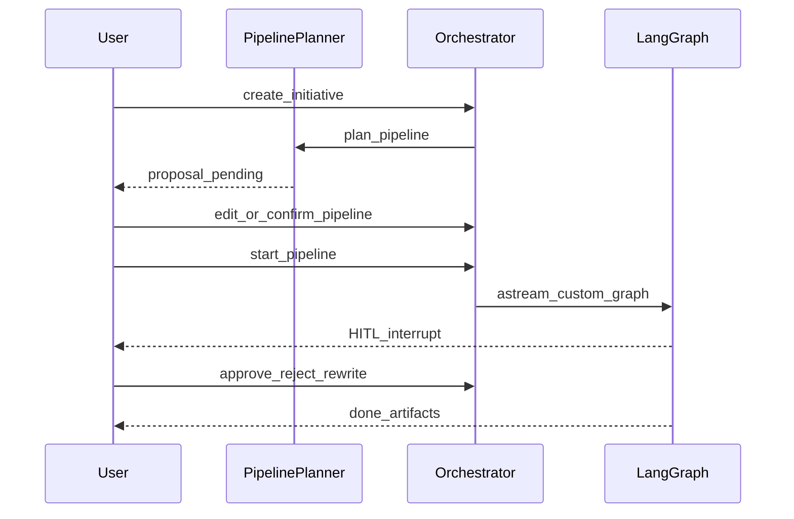

# Data Flow

## Mission lifecycle

## Artifact handoff

1. A stage executor returns `StageResult.artifacts` (filename → content).
2. `ArtifactStore` writes under `data/artifacts/<initiative>/<stage>/`.
3. Paths accumulate in graph state `upstream`; later stages read text via `StageContext.upstream_artifacts`.
4. Contracts in `contracts.REQUIRED` validate required filenames per stage.

## Realtime

- `GET /api/initiatives/{id}/events` — SSE for progress / HITL / room messages.
- Room messages persist under `data/rooms/` via `RoomStore`.

## Checkpoints

LangGraph checkpointer (SQLite by default, optional Postgres) stores thread state keyed by initiative `thread_id`, so HITL resume survives process restart when the same checkpoint DB is reused.
