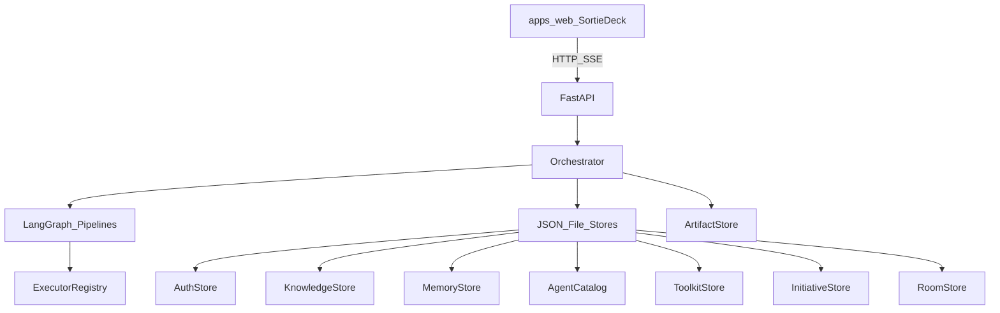

# Architecture Overview

## Design principles

1. **Contracted artifacts** — stages emit named files; downstream reads files, not chat paste.
2. **Human-in-the-loop** — clearance gates use LangGraph `interrupt()`; squad slash commands resume.
3. **Pluggable executors** — coding / deploy providers are registry plugins, not hard-wired into the graph.
4. **Confirmable pipelines** — the planner proposes stages; humans confirm or edit before start.
5. **Composable loadout** — published agents, toolkits, and memory attach per mission.

## System context

| Layer | Responsibility | Primary code |
|-------|----------------|--------------|
| Workbench | UI, i18n, themes, pipeline editor | `apps/web` |
| API | Auth, REST, SSE | `api/app.py` |
| Orchestrator | Mission lifecycle, rooms, graph pick | `orchestrator.py` |
| Pipelines | Track YAML → compiled graphs | `graph.py`, `pipeline.py`, `packages/templates` |
| Stores | JSON persistence (dev-friendly) | `*_store` modules under `src/sortie_deck` |
| Executors | Stage runners | `plugins/`, `registry.py` |

## Borrowings

| Source | Adopted | Not adopted |
|--------|---------|-------------|
| AgentTeams | Manager–workers, shared artifacts, HITL visibility | Matrix, Higress, K8s CRDs |
| TAKT / harness ideas | Stage contracts, provider adapters, worktrees | Full YAML workflow engine fork |

## Current limitations

- Persistence is mostly **JSON files** under `data/` (not multi-tenant production DB).
- Many stages ship with **mock** executors for local demos.
- Pipeline planner supports optional LLM (`TDT_PIPELINE_LLM`) with heuristic fallback; human confirm remains mandatory.
- Custom graphs are compiled per confirmed mission into the orchestrator process.

See [Data Flow](data-flow.md) and [Roadmap](../roadmap.md).
