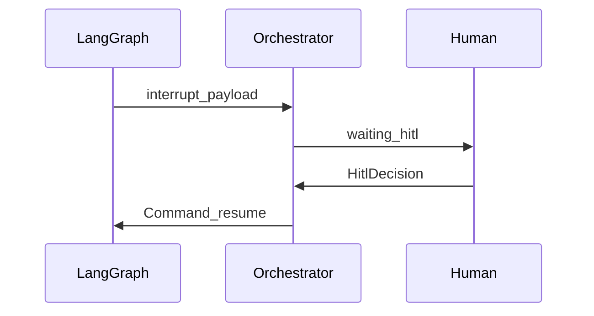

# Human-in-the-loop (HITL)

## Intent

Agents can move fast, but **launch, rewrite, and privilege escalation** must stay visible, resumable, and auditable by humans.

## Mechanisms

| Mechanism | Behavior |
|-----------|----------|
| LangGraph `interrupt()` | Graph pauses; payload becomes pending HITL |
| Workbench / API resume | approve / reject / rewrite / stop / reroute |
| Squad slash + room | Visible discussion; commands can drive decisions |
| Coding permission modes | Align with Claude Code semantics (e.g. `acceptEdits`) via instruction tags |

## Constraints

- **Block by default** on gated stages (`hitl_after`); QA fail can `on_fail` back to a build wave.
- **HITL inside parallel waves** may pause the wave on permission blocks; resume re-enters the wave.
- **Pipeline confirm ≠ stage HITL** — confirm happens before `start`; stage gates live inside the graph.

## Evolution (see TODO)

- Humans speak in-channel with exclusive role binding.
- Agent outbound messages default to confirm or user permission modes.
- Optional decisionors (e.g. TypeSafe Jev) may **suggest** actions without replacing `interrupt()` pause semantics.

Modules: [Graph](../modules/graph.md), [Rooms](../modules/rooms.md), [Orchestrator](../modules/orchestrator.md).
