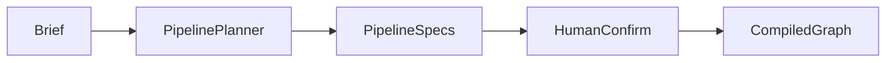

# Pipeline & graph design

## Intent

Capture *what runs next, who runs it, and what can fan out* as a **confirmable stage graph**, not a one-shot script.

## Model

1. **Propose** — `pipeline_planner` (heuristic or optional LLM) emits `pipeline_specs` (nodes, roles, `branch` / `parallel_group` / `depends_on`).
2. **Confirm** — after human confirm/edit, `materialize_template` → `build_graph_from_template` → compile `custom:{initiative_id}`.
3. **Run** — LangGraph executes single nodes or parallel waves; HITL uses `interrupt()`.



## Parallel branches

Multi-surface work (e.g. Web ∥ backend) is modeled as **branch chains**, not one shared self-test node:

```text
cases
 ├─ web build → web self-test ──┐
 └─ backend build → backend self-test ──┴→ integrate
```

- Same `parallel_group`, different `branch`: wave runs branch sequences via `asyncio.gather`.
- Workbench rail lays out fork / merge; edge motion is presentation-only.

Code: `parallel.py`, `graph.py`, `PipelineRail.tsx`.

## Artifact contracts

- Executors return filename → content into `ArtifactStore`.
- `contracts.REQUIRED` enforces required files.
- Parallel members keep stage-scoped paths when basenames collide.

## UI contract

| Field | Use |
|-------|-----|
| `pipeline_rail` / `pipeline_specs` | Rail rendering |
| `active_parallel` | Live wave highlight |
| `depends_on` | Graph semantics / inspect |

See modules: [Pipeline](../modules/pipeline.md), [Graph](../modules/graph.md).
