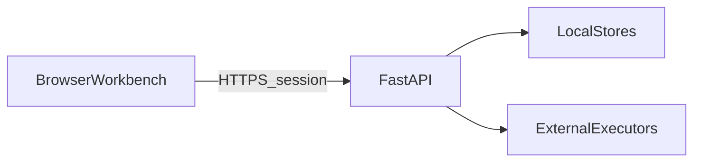

# Threat model (draft)

> Lightweight STRIDE-style notes for the open-source default (single-host / small team). Not a formal certification assessment.

## Assets

| Asset | Notes |
|-------|-------|
| Session tokens | Login state |
| Mission briefs / artifacts | May include internal business data |
| Executor credentials | Claude / Cursor / cloud vendors |
| Room messages | Discussion and decision traces |
| Knowledge / memory | Org conventions and preferences |

## Trust boundaries

- Browsers never touch `data/` directly.
- Executors on local or external CLIs are **semi-trusted** (can read worktrees).
- Webhook / IM bridges: validate inbound events against forgery.

## Key risks & mitigations

| Risk | Mitigation (current or intended) |
|------|----------------------------------|
| Path traversal on artifacts | Safe path resolution in ArtifactStore |
| Unauthorized HITL / start-stop | Session + RBAC (admin/member) |
| Arbitrary toolkit commands | Org policy; review imports |
| Prompt / artifact poisoning | Contracts + human gates; no auto privilege escalation |
| Secrets in git | `.gitignore` for `.env` / `data/`; docs call this out |

## Explicit non-guarantees

- Strong multi-tenant isolation or full compliance audit trails.
- Adversarial sandboxing (depends on executor permission modes).
- Abuse protection for public internet hosting (private deploy assumed).

Report vulnerabilities per [SECURITY.md](../../../SECURITY.md).
