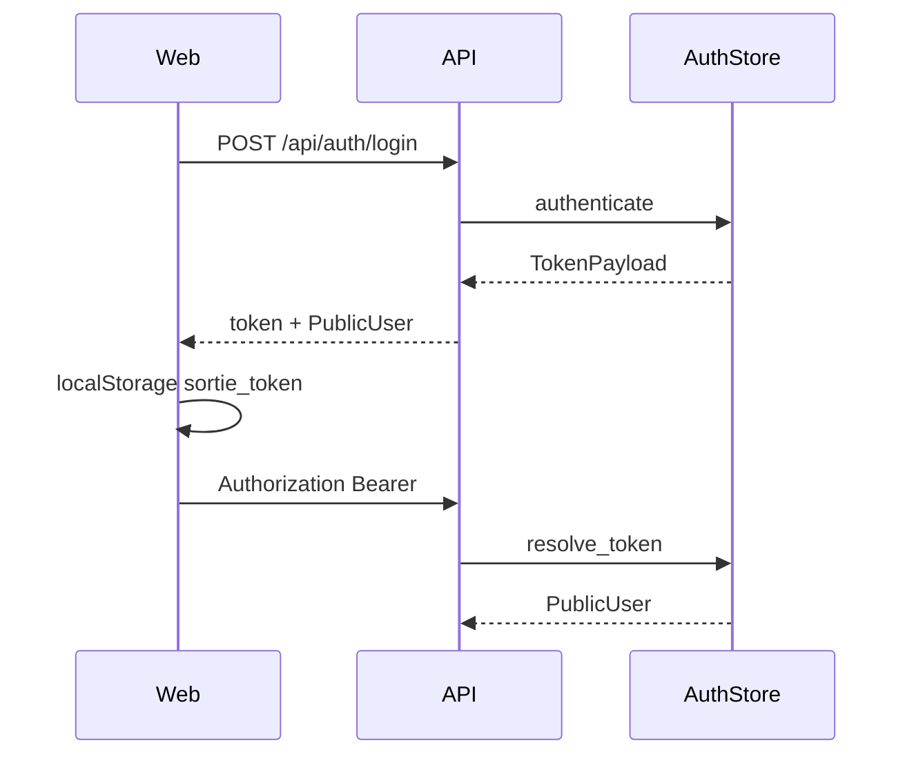

# Auth & RBAC

## 1. Overview

Auth is the **first entry** for humans into Sortie Deck: login, session token, role gate (`admin` / `member`), and admin user CRUD.

| Item | Value |
|------|-------|
| Owner module | `sortie_deck.auth` |
| Primary consumers | FastAPI deps, workbench login, admin page |
| Persistence | `data/users.json` |

## 2. Scope & non-goals

**In scope**

- Username/password login with PBKDF2-HMAC password hashes
- Opaque bearer tokens signed with HMAC
- Role-based access (`admin` for user admin APIs)
- Seed users for local development

**Out of scope (near term)**

- Full OIDC / SAML product integration (listed as P1 adapter)
- Multi-tenant org membership claims
- Fine-grained permission matrix beyond admin/member

## 3. Code map

| Path | Role |
|------|------|
| `src/sortie_deck/auth.py` | `AuthStore`, hash/verify, token issue/validate, user CRUD |
| `src/sortie_deck/api/app.py` | `/api/auth/*`, `/api/admin/users*`, `require_user` |
| `apps/web/src/App.tsx` | Login form, `sortie_token` in localStorage, logout |

## 4. Data model

```text
User
  id: usr_*
  username: str (unique)
  display_name: str
  role: admin | member
  password_hash: "{salt}${pbkdf2_sha256_hex}"  # 120k iterations
  created_at: ISO-8601

PublicUser = User without password_hash

TokenPayload { token, user: PublicUser }
```

Token format (current): HMAC over `user_id|expiry|nonce` using `token_secret` (dev default `tdt-dev-secret`).

## 5. API contract

| Method | Path | Auth | Notes |
|--------|------|------|-------|
| POST | `/api/auth/login` | public | body `{username,password}` → `{token,user}` |
| POST | `/api/auth/logout` | user | best-effort invalidate / client drop |
| GET | `/api/auth/me` | user | current `PublicUser` |
| GET | `/api/admin/users` | admin | list users |
| POST | `/api/admin/users` | admin | create |
| DELETE | `/api/admin/users/{id}` | admin | delete (guard last admin) |

Errors: `401` unauthorized, `403` forbidden, `400` validation / duplicate username.

## 6. Critical paths



## 7. Technical design

### Current

- File-locked JSON store suitable for single-node demos
- Workbench trusts localStorage token (XSS risk if compromised)

### Target

1. **Config**: `TDT_TOKEN_SECRET` required in non-dev; rotate support
2. **Interface**: `IdentityProvider` protocol — `LocalAuthStore` + optional `OidcBridge`
3. **Sessions**: server-side session table or short-lived JWT + refresh
4. **Audit**: append-only log for admin user mutations
5. **Rate limit**: login endpoint

## 8. Development plan

### P0 — Harden & document (1–2 days)

| Task | Acceptance |
|------|------------|
| Document threat model (token theft, weak secret) | SECURITY.md section + this page |
| Env `TDT_TOKEN_SECRET` wired; refuse empty in prod mode | settings + test |
| Ensure tokens never logged | grep / review logging |
| Unit tests: hash verify, bad login, admin gate | pytest green |

### P1 — Pluggable identity (3–5 days)

| Task | Acceptance |
|------|------------|
| Extract `AuthStore` protocol | Local impl passes existing tests |
| Login rate limit (IP + username) | 429 after N failures |
| Optional OIDC authorization-code sketch | docs + feature flag stub |

### P2 — Multi-tenant claims (1–2 weeks)

| Task | Acceptance |
|------|------------|
| `org_id` / team on token | API filter by org |
| SCIM-lite user sync hook | interface only |

## 9. Test plan

- Unit: password hash roundtrip, token forge rejection
- API: login → me → admin create/delete
- Negative: member cannot hit admin routes

## 10. Dependencies

- Blocks: nothing (entry)
- Blocked by: none for P0
- Related: Web login UX, SECURITY.md disclosure process
