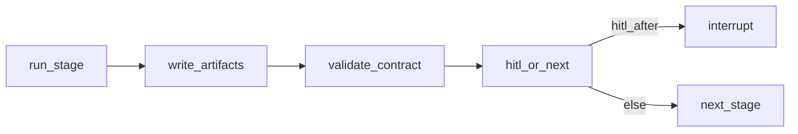

# Graph, HITL & Contracts

## 1. Overview

Compiles and runs stage graphs; pauses for human clearance; validates artifact contracts between roles.

| Item | Value |
|------|-------|
| Code | `graph.py`, `contracts.py`, `models.py` |
| Checkpointer | SQLite default; optional Postgres |

## 2. Scope

- `build_graph_from_template` — nodes, HITL gates, linear next, on_fail/on_reject
- `StageContext` toolkit/persona injection
- `REQUIRED` filename contracts
- Shared checkpointer across track graphs + custom

## 3. Stage execution

HITL resume actions: `approve` → next (qa may on_fail); `reject` → on_reject; `edit_instruction` → re-run stage; `stop` → END; `reroute` → named stage.

### HITL action matrix

| Action | Room command | API `HitlDecision.action` | Graph behavior |
|--------|--------------|---------------------------|----------------|
| Clear | `/approve [note]` | `approve` | Linear next stage; failed `qa_verify` uses `on_fail` |
| Bounce | `/reject reason` | `reject` | `goto` template `on_reject` (often `eng_implement`) |
| Revise & re-run | `/rewrite instruction` | `edit_instruction` | Set `human_instruction`, `goto` current stage |
| Abort | `/stop` | `stop` | `status=stopped`, `goto` END |
| Reroute | (API / UI) | `reroute` + `next_stage` | `goto` named stage id |

Gate nodes are named `hitl__{stage_name}` and are wired only when `hitl_after: true` on that stage in YAML or a custom spec.

## 4. Contracts

`contracts.REQUIRED` examples:

- `product_prd`: `prd.md`, `acceptance.json`
- `design_ui`: `design.md`, `screens.json`
- `eng_implement` / `eng_ios` / …: `implementation.md`, `tasks.json`, `diff.patch`
- `qa_verify`: `test_report.json`, `test_cases.md`
- plus `qa_cases`, `eng_selftest`, `eng_integrate`, `qa_handoff`, `deploy_preview`

Missing files → `ContractError` fails the run.

## 5. Technical design (target)

- Versioned contracts (`contract_version` on template)
- JSON Schema validation for `*.json` artifacts
- OpenTelemetry span per stage (`stage`, `executor`, `initiative_id`)
- Optional auto-approve policy for non-prod tracks

## 6. Development plan

### P0 (2–4 days)

| Task | Acceptance |
|------|------------|
| Contract test per catalog stage | mock executors produce required files |
| Document HITL matrix in this page | done |
| Ensure custom compile preserves HITL edges | unit |

### P1 (1 week)

| Task | Acceptance |
|------|------------|
| OTel spans | exported in dev |
| Richer interrupt payload (artifact previews) | UI consumes |
| Contract version field | mismatch soft-warn |

### P2 (2 weeks)

| Task | Acceptance |
|------|------------|
| Parallel fan-out stages | YAML `parallel_group` |
| Auto-approve rules | gated by settings |

## 7. Test plan

- `tests/test_pipeline.py` HITL loop
- Contract missing → fail
- Reject on qa → eng_implement

## 8. Dependencies

- Executors produce artifacts; Orchestrator resumes; Pipeline supplies templates
