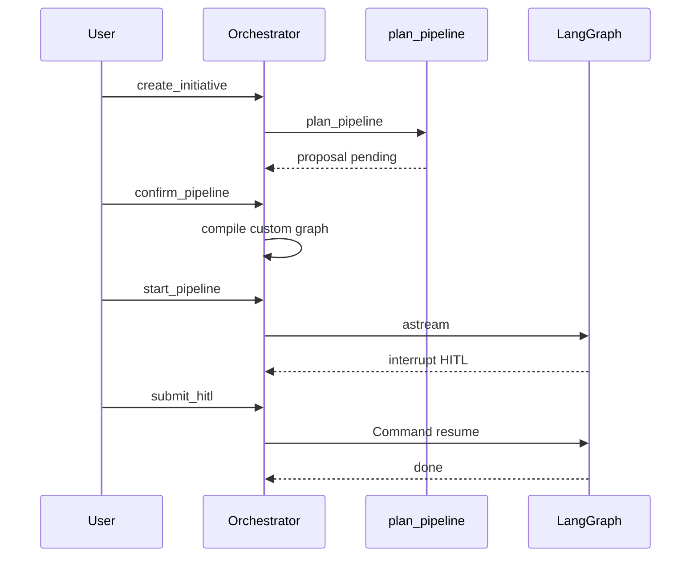

# Initiatives & Orchestrator

## 1. Overview

The orchestrator is the **control-plane core** after login: mission lifecycle, pipeline confirm binding, graph selection, HITL resume, squad posts, SSE, artifact sync.

| Item | Value |
|------|-------|
| Code | `orchestrator.py`, `store.py` |
| Store | `data/initiatives.json` |
| Runtime graphs | `default` / `express` / `standard` + `custom:{initiative_id}` |

## 2. Scope & non-goals

**In scope**

- CRUD missions, start/stop, HITL, pipeline update/confirm
- Bind agent catalog + toolkit + memory briefs at create
- Compile custom graph after confirm; refuse start if unconfirmed
- Room slash commands wired to lifecycle

**Out of scope**

- Horizontal multi-worker scheduler (P2)
- Replacing LangGraph

## 3. Code map

| Symbol / area | Responsibility |
|---------------|----------------|
| `Orchestrator.create_initiative` | planner proposal, meta, room seeds |
| `confirm_pipeline` / `update_pipeline` | specs normalize, compile custom graph |
| `start_pipeline` | gate on `pipeline_confirmed`, spawn `_run_until_interrupt` |
| `submit_hitl` / `stop` | resume `Command` |
| `_graph_for` / `_compile_custom_graph` | track vs custom |
| `InitiativeStore` | JSON persistence |

## 4. State machine

```text
draft ──confirm──► draft(confirmed)
  │ start
  ▼
running ◄──approve/reject/rewrite── waiting_hitl
  │
  ├── stop ► stopped
  ├── error ► failed
  └── complete ► done
```

## 5. API surface

| Method | Path | Notes |
|--------|------|-------|
| GET/POST | `/api/initiatives` | list / create |
| GET/DELETE | `/api/initiatives/{id}` | |
| POST | `.../start` | 400 if not confirmed |
| PATCH | `.../pipeline` | edit specs; optional confirm |
| POST | `.../pipeline/confirm` | lock + compile |
| POST | `.../hitl` | HitlSubmitRequest |
| POST | `.../stop` | |
| GET | `.../events` | SSE |

Create body highlights: `brief`, `coding_executor`, `role_agents`, `role_toolkits`, `pipeline_track`, `complexity`, `auto_confirm_pipeline` (CLI/tests).

## 6. Critical path



## 7. Technical design

### Current risks

- Large `Orchestrator` class (god-object)
- In-process custom graph map; lost on restart until re-confirm/compile
- JSON store not multi-writer safe beyond coarse locks

### Target structure

```text
services/
  MissionService
  PipelineBindingService   # confirm/compile
  RunService               # astream + HITL
  RoomBridge
repositories/
  InitiativeRepository     # JSON → SQL
```

On process boot: rebuild custom graphs for draft/running confirmed missions from `pipeline_specs`.

## 8. Development plan

### P0 (3–5 days)

| Task | Acceptance |
|------|------------|
| Integration test: create → edit → confirm → start → HITL → done | pytest |
| Recompile custom graphs on `startup()` for confirmed ids | restart mid-HITL works |
| Structured error codes (`pipeline_not_confirmed`) | API JSON + UI |

### P1 (1–2 weeks)

| Task | Acceptance |
|------|------------|
| Split PipelineBinding + Run services | import graph cleaner |
| SQL initiative repository behind interface | feature flag |
| Idempotent start | second start no double task |

### P2 (2+ weeks)

| Task | Acceptance |
|------|------------|
| External run queue / lock | 2 workers safe |
| Outbox for webhooks + SSE | at-least-once |

## 9. Test plan

- Existing `tests/test_pipeline*.py`, `test_rooms.py` extended
- Fail start without confirm
- Confirm after manual stage drop still validates contracts at runtime

## 10. Dependencies

- Pipeline planner, Graph builder, Rooms, Auth (API), Executors
