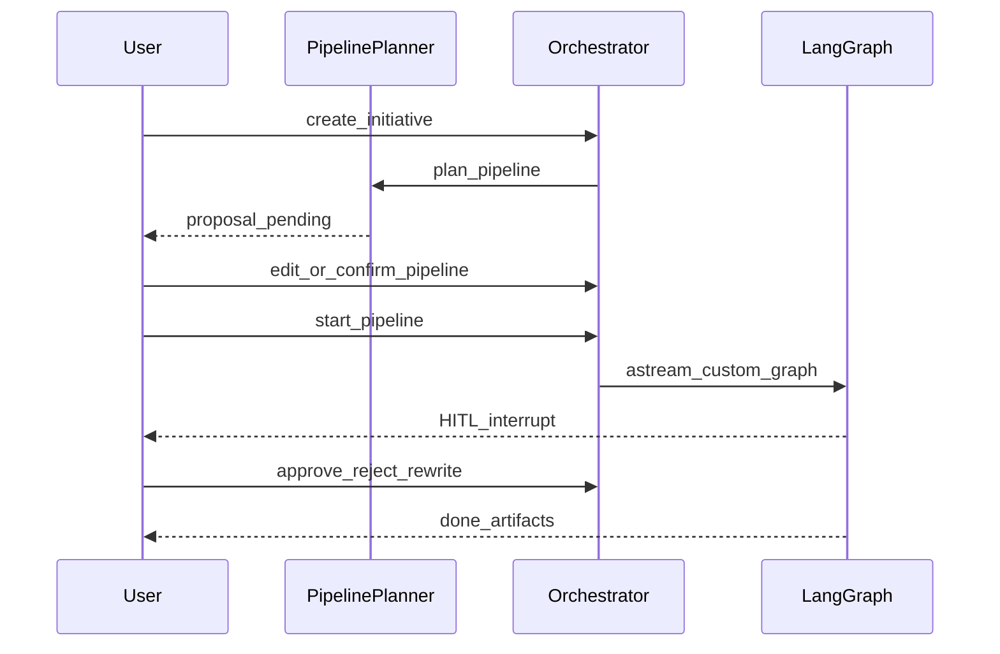

# 数据流

## 任务生命周期

## 产物交接

1. 阶段执行器返回 `StageResult.artifacts`（文件名 → 内容）。
2. `ArtifactStore` 写入 `data/artifacts/<initiative>/<stage>/`。
3. 路径累积到图状态 `upstream`；后续阶段经 `StageContext.upstream_artifacts` 读文本。
4. `contracts.REQUIRED` 校验各阶段必选文件名。

## 实时

- `GET /api/initiatives/{id}/events` — SSE（进度 / HITL / 频道消息）。
- 频道消息由 `RoomStore` 落在 `data/rooms/`。

## 检查点

LangGraph checkpointer（默认 SQLite，可选 Postgres）按任务 `thread_id` 存线程状态；同一 checkpoint DB 下 HITL 恢复可跨进程重启。
