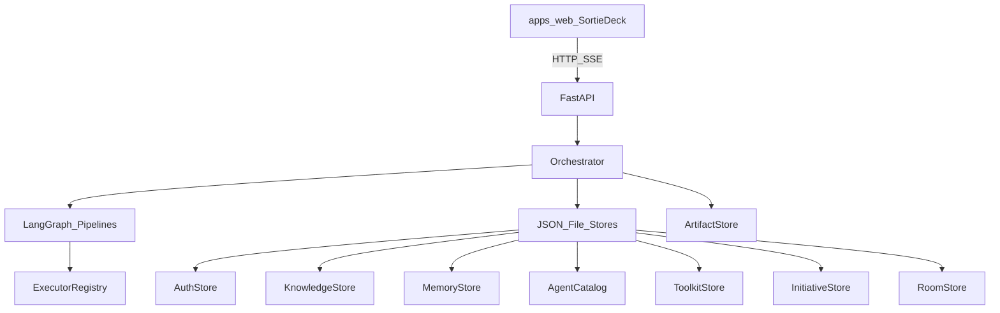

# 架构总览

## 设计原则

1. **契约化产物** — 阶段产出命名文件；下游读文件，不读聊天粘贴。
2. **人在环** — 门禁用 LangGraph `interrupt()`；小队斜杠命令恢复。
3. **可插拔执行器** — 编码 / 发布提供者是注册表插件，不写死在图里。
4. **可确认航线** — 规划官提案；出击前真人确认或手改。
5. **可组合编制** — 已发布角色、工具包、记忆按任务挂载。

## 系统上下文

| 层 | 职责 | 主要代码 |
|----|------|----------|
| 工作台 | UI、i18n、主题、航线编辑 | `apps/web` |
| API | 认证、REST、SSE | `api/app.py` |
| 编排器 | 任务生命周期、频道、选图 | `orchestrator.py` |
| 航线 | YAML → 编译图 | `graph.py`, `pipeline.py`, `packages/templates` |
| 存储 | JSON 持久化（便于本地） | `src/sortie_deck` 内各 store |
| 执行器 | 阶段运行器 | `plugins/`, `registry.py` |

## 借鉴

| 来源 | 采用 | 未采用 |
|------|------|--------|
| AgentTeams | Manager–Workers、共享产物、HITL 可见性 | Matrix、Higress、K8s CRD |
| TAKT / harness | 阶段契约、provider 适配、worktree | 完整 YAML 工作流引擎分叉 |

## 当前局限

- 持久化多为 `data/` 下 **JSON 文件**（非多租户生产库）。
- 多数阶段默认 **mock** 执行器，便于本地演示。
- 航线规划官支持可选 LLM（`TDT_PIPELINE_LLM`），失败回落启发式；出击前人手确认仍强制。
- 确认后的自定义图在编排器进程内按任务编译。

见 [数据流](data-flow.md) 与 [路线图](../roadmap.md)。
