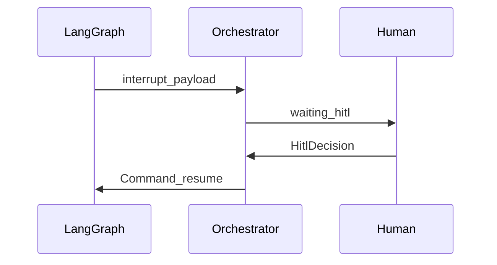

# 人在环（HITL）

## 意图

Agent 可以跑得快，但 **出击权、改写权、权限升级** 必须可被真人看见、可恢复、可审计。

## 机制

| 机制 | 行为 |
|------|------|
| LangGraph `interrupt()` | 图暂停，payload 进待办 HITL |
| 工作台 / API 恢复 | approve / reject / rewrite / stop / reroute |
| 小队斜杠与频道 | 可见讨论；命令可驱动决策 |
| 编码权限档 | 对齐 Claude Code 语义（如 `acceptEdits`），写入 instruction 标签重试 |

## 设计约束

- **默认阻断**：关键阶段 `hitl_after`；QA 失败可 `on_fail` 回到构建波。
- **并行波内 HITL**：权限类阻塞可单分支打断整波，恢复后重进 wave。
- **规划确认 ≠ 阶段 HITL**：航线确认发生在 `start` 之前；阶段门禁在图内。

## 演进（见 TODO）

- 真人发言进频道、角色排他绑定。
- AI 出站默认需确认或按用户档位。
- 可选决策器（如 TypeSafe Jev）只给 **建议**，不替代 `interrupt()` 暂停语义。

模块：[图与门禁](../modules/graph.md)、[小队频道](../modules/rooms.md)、[编排](../modules/orchestrator.md)。
