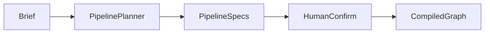

# 航线与图编排

## 意图

把「先做什么、谁做、能否并行」收成 **可确认的阶段图**，而不是一次性写死的脚本。

## 模型

1. **提案**：`pipeline_planner`（启发式或可选 LLM）产出 `pipeline_specs`（节点、角色、`branch` / `parallel_group` / `depends_on`）。
2. **确认**：真人确认或手改后，`materialize_template` → `build_graph_from_template` → 按任务编译 `custom:{initiative_id}`。
3. **运行**：LangGraph 跑单节点或并行 wave；HITL 用 `interrupt()`。



## 并行分支

多端场景（如 Web ∥ 后端）按 **分支链** 建模，而不是共用一个自测节点：

```text
用例
 ├─ Web 开发 → Web 自测 ──┐
 └─ 后端开发 → 后端自测 ──┴→ 联调
```

- 同一 `parallel_group` + 不同 `branch`：wave 内 `asyncio.gather` 跑各分支序列。
- UI 轨道按列 / 泳道画分叉与汇合；边可表达进度（炫彩流动为展示层）。

实现要点：`parallel.py`（collapse waves / branches）、`graph.py`（wave node）、`PipelineRail.tsx`。

## 产物契约

- 执行器返回文件名 → 内容；写入 `ArtifactStore`。
- `contracts.REQUIRED` 校验必选文件。
- 并行成员文件名冲突时按路径保留 stage 作用域（`stage::kind` 同步策略）。

## 与 UI 的契约

| 字段 | 用途 |
|------|------|
| `pipeline_rail` / `pipeline_specs` | 轨道渲染 |
| `active_parallel` | 当前波成员高亮 |
| `depends_on` | 图语义 / 检查面板 |

详见模块：[航线规划](../modules/pipeline.md)、[图与门禁](../modules/graph.md)。
