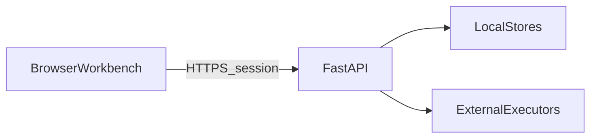

# 威胁模型（初稿）

> 轻量 STRIDE 视角，服务开源默认部署（单机 / 小团队）。非正式认证级安全评估。

## 资产

| 资产 | 说明 |
|------|------|
| 会话 token | 登录态 |
| 任务 brief / 产物 | 可能含内部业务信息 |
| 执行器凭据 | Claude / Cursor / 云厂商 |
| 频道消息 | 讨论与决策痕迹 |
| 知识 / 记忆 | 组织约定与偏好 |

## 信任边界

- 浏览器不直接碰 `data/`。
- 执行器在本机或外部 CLI：视为 **半信任**（可读 worktree）。
- Webhook / IM 桥：入站需校验，防伪造事件。

## 主要风险与缓解

| 风险 | 缓解（现状或目标） |
|------|-------------------|
| 路径穿越读写产物 | ArtifactStore 安全路径解析 |
| 未授权 HITL / 启停 | 会话 + RBAC（admin/member） |
| 工具箱任意命令 | Org policy；导入审查 |
| Prompt / 产物投毒 | 契约与人工门禁；不自动提权 |
| Secret 进仓库 | `.gitignore` 忽略 `.env` / `data/`；文档强调 |

## 明确不保证

- 多租户强隔离、合规审计日志全集。
- 对抗级沙箱（依赖执行器自身权限模式）。
- 公共实例上的滥用防护（默认按私有部署假设）。

贡献安全问题请走 [SECURITY.md](../../../SECURITY.md)。
