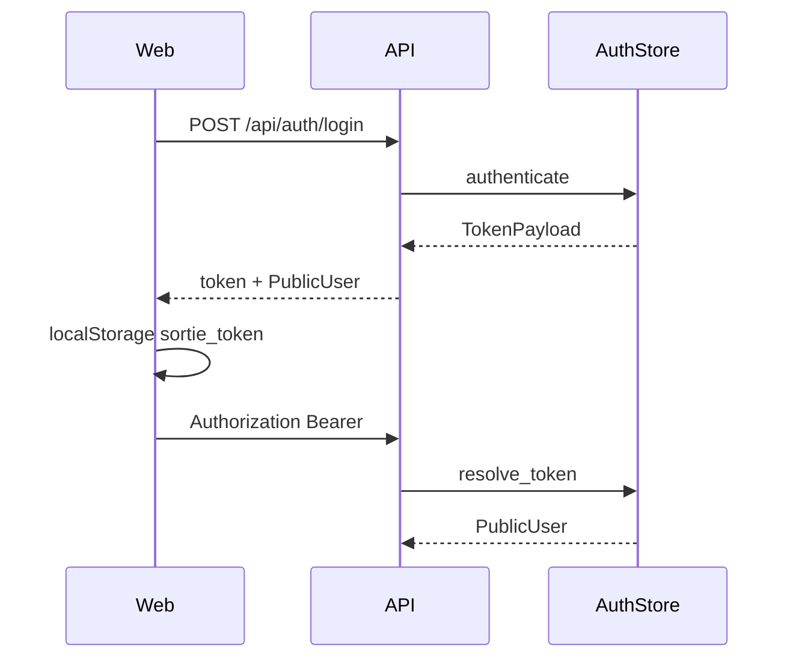

# 认证与权限

## 1. 概述

Auth 是真人进入 Sortie Deck 的**第一入口**：登录、session token、角色门禁（`admin` / `member`）、管理员用户 CRUD。

| 项 | 值 |
|----|-----|
| 归属 | `sortie_deck.auth` |
| 主要消费方 | FastAPI 依赖、工作台登录、管理页 |
| 持久化 | `data/users.json` |

## 2. 范围与非目标

**范围内**

- 用户名口令登录，PBKDF2-HMAC 哈希
- HMAC 签发的不透明 Bearer token
- 基于角色的访问（用户管理仅 admin）
- 本地开发种子账号

**近期非目标**

- 完整 OIDC / SAML 产品化（P1 适配器）
- 多租户组织成员声明
- 细于 admin/member 的权限矩阵

## 3. 代码地图

| 路径 | 职责 |
|------|------|
| `src/sortie_deck/auth.py` | `AuthStore`、哈希校验、发/验 token、用户 CRUD |
| `src/sortie_deck/api/app.py` | `/api/auth/*`、`/api/admin/users*`、`require_user` |
| `apps/web/src/App.tsx` | 登录表单、`sortie_token`、退出 |

## 4. 数据模型

```text
User
  id: usr_*
  username: str（唯一）
  display_name: str
  role: admin | member
  password_hash: "{salt}${pbkdf2_sha256_hex}"  # 12 万次迭代
  created_at: ISO-8601

PublicUser = 不含 password_hash 的 User

TokenPayload { token, user: PublicUser }
```

Token（现状）：用 `token_secret`（开发默认 `tdt-dev-secret`）对 `user_id|expiry|nonce` 做 HMAC。

## 5. API 契约

| 方法 | 路径 | 鉴权 | 说明 |
|------|------|------|------|
| POST | `/api/auth/login` | 公开 | `{username,password}` → `{token,user}` |
| POST | `/api/auth/logout` | 用户 | 尽力失效 / 客户端丢弃 |
| GET | `/api/auth/me` | 用户 | 当前 `PublicUser` |
| GET | `/api/admin/users` | 管理员 | 列表 |
| POST | `/api/admin/users` | 管理员 | 创建 |
| DELETE | `/api/admin/users/{id}` | 管理员 | 删除（保护最后一位 admin） |

错误：`401` / `403` / `400`（校验 / 重名）。

## 6. 关键路径



## 7. 技术方案

### 现状

- 单机友好的文件锁 JSON
- 工作台信任 localStorage token（XSS 风险）

### 目标

1. **配置**：非开发环境强制 `TDT_TOKEN_SECRET`；支持轮换
2. **接口**：`IdentityProvider` 协议 — `LocalAuthStore` + 可选 `OidcBridge`
3. **会话**：服务端 session 表或短 JWT + refresh
4. **审计**：管理员变更追加写日志
5. **限流**：登录接口

## 8. 开发计划

### P0 — 加固与文档（1–2 天）

| 任务 | 验收 |
|------|------|
| 威胁模型（token 窃取、弱密钥） | SECURITY.md + 本文 |
| 接入 `TDT_TOKEN_SECRET`；生产拒绝空密钥 | settings + 测试 |
| 确保日志不打印 token | 日志审查 |
| 单测：哈希、错误登录、管理门禁 | pytest 绿 |

### P1 — 可插拔身份（3–5 天）

| 任务 | 验收 |
|------|------|
| 抽出 `AuthStore` 协议 | Local 实现过现有测试 |
| 登录限流（IP + 用户名） | 超限 429 |
| OIDC 授权码草图 | 文档 + 特性开关桩 |

### P2 — 多租户声明（1–2 周）

| 任务 | 验收 |
|------|------|
| token 带 `org_id` / team | API 按组织过滤 |
| SCIM-lite 同步钩子 | 仅接口 |

## 9. 测试计划

- 单测：口令哈希往返、伪造 token 拒绝
- API：login → me → admin 增删
- 负例：member 打不开 admin

## 10. 依赖

- 阻塞他人：无（入口）
- 被阻塞：P0 无
- 关联：Web 登录 UX、SECURITY 披露流程
