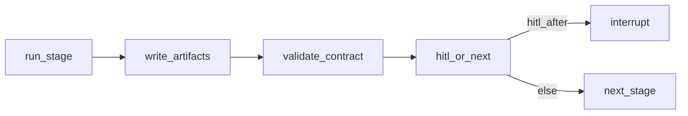

# 图·门禁·契约

## 1. 概述

编译并运行阶段图；门禁暂停等人；角色间校验产物契约。

| 项 | 值 |
|----|-----|
| 代码 | `graph.py`、`contracts.py`、`models.py` |
| Checkpointer | 默认 SQLite；可选 Postgres |

## 2. 范围

- `build_graph_from_template` — 节点、HITL、线性后继、on_fail/on_reject
- `StageContext` 注入工具/人设
- `REQUIRED` 文件名契约
- 航线图与自定义图共享 checkpointer

## 3. 阶段执行

HITL：`approve` 前进（qa 可能 on_fail）；`reject` → on_reject；`edit_instruction` 重跑；`stop` 结束；`reroute` 指定阶段。

### HITL 动作矩阵

| 动作 | 房间命令 | API `HitlDecision.action` | 图行为 |
|------|----------|---------------------------|--------|
| 放行 | `/approve [note]` | `approve` | 线性下一节点；`qa_verify` 未通过时走 `on_fail` |
| 打回 | `/reject 原因` | `reject` | `goto` 模板 `on_reject`（常见回 `eng_implement`） |
| 修订重跑 | `/rewrite 指令` | `edit_instruction` | 写入 `human_instruction`，`goto` 当前阶段重跑 |
| 停止 | `/stop` | `stop` | `status=stopped`，`goto` END |
| 改道 | （API / UI） | `reroute` + `next_stage` | `goto` 指定阶段 id |

门禁节点命名：`hitl__{stage_name}`，仅当 YAML / 自定义 spec 中 `hitl_after: true` 时插入。

## 4. 契约

`contracts.REQUIRED` 示例：`product_prd`、`design_ui`、`eng_implement` / `eng_ios`…、`qa_verify` 以及用例 / 自测 / 联调 / 提测 / 发布等。缺文件 → `ContractError`。

## 5. 技术方案（目标）

- 契约版本化
- JSON Schema 校验 `*.json`
- 每阶段 OTel span
- 非生产航线可选自动放行

## 6. 开发计划

### P0（2–4 天）

| 任务 | 验收 |
|------|------|
| 目录每阶段契约测试 | mock 产出齐全 |
| 本文 HITL 矩阵 | 完成 |
| 自定义编译保留 HITL 边 | 单测 |

### P1（1 周）

| 任务 | 验收 |
|------|------|
| OTel span | 开发可导出 |
| 更丰富 interrupt payload | UI 可用 |
| contract_version | 不匹配软警告 |

### P2（2 周）

| 任务 | 验收 |
|------|------|
| 并行扇出 | YAML `parallel_group` |
| 自动放行规则 | settings 门禁 |

## 7. 测试计划

- HITL 回环、契约缺失失败、QA reject 回 eng

## 8. 依赖

- Executors 产产物；Orchestrator 恢复；Pipeline 供模板
