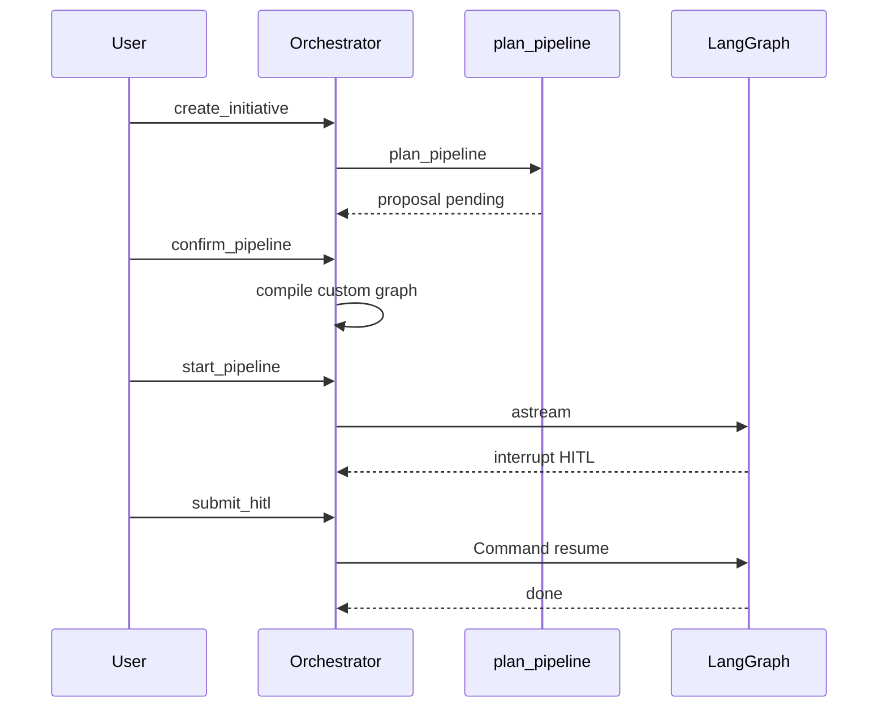

# 任务与编排

## 1. 概述

编排器是登录后的**控制面核心**：任务生命周期、航线确认绑定、选图、HITL 恢复、小队发帖、SSE、产物同步。

| 项 | 值 |
|----|-----|
| 代码 | `orchestrator.py`、`store.py` |
| 存储 | `data/initiatives.json` |
| 运行时图 | `default` / `express` / `standard` + `custom:{id}` |

## 2. 范围与非目标

**范围内**

- 任务 CRUD、出击/停止、HITL、航线改/确认
- 创建时绑定角色目录、工具箱、记忆 brief
- 确认后编译自定义图；未确认拒绝出击
- 斜杠命令接到生命周期

**非目标**

- 水平多 worker 调度（P2）
- 替换 LangGraph

## 3. 代码地图

| 符号 / 区域 | 职责 |
|-------------|------|
| `create_initiative` | 规划提案、meta、频道种子 |
| `confirm_pipeline` / `update_pipeline` | specs 规范化、编译自定义图 |
| `start_pipeline` | `pipeline_confirmed` 门禁、拉起 `_run_until_interrupt` |
| `submit_hitl` / `stop` | `Command` 恢复 |
| `_graph_for` / `_compile_custom_graph` | 航线 vs 自定义 |
| `InitiativeStore` | JSON 持久化 |

## 4. 状态机

```text
draft ──confirm──► draft(confirmed)
  │ start
  ▼
running ◄──approve/reject/rewrite── waiting_hitl
  │
  ├── stop ► stopped
  ├── error ► failed
  └── complete ► done
```

## 5. API 面

| 方法 | 路径 | 说明 |
|------|------|------|
| GET/POST | `/api/initiatives` | 列表 / 创建 |
| GET/DELETE | `/api/initiatives/{id}` | |
| POST | `.../start` | 未确认 400 |
| PATCH | `.../pipeline` | 改 specs；可带 confirm |
| POST | `.../pipeline/confirm` | 锁定 + 编译 |
| POST | `.../hitl` | |
| POST | `.../stop` | |
| GET | `.../events` | SSE |

创建体要点：`brief`、`coding_executor`、`role_agents`、`role_toolkits`、`pipeline_track`、`complexity`、`auto_confirm_pipeline`。

## 6. 关键路径



## 7. 技术方案

### 现状风险

- `Orchestrator` 过大
- 自定义图在进程内；重启需重编译
- JSON 多写者不够安全

### 目标结构

```text
services/
  MissionService
  PipelineBindingService
  RunService
  RoomBridge
repositories/
  InitiativeRepository
```

进程启动时：按已确认任务的 `pipeline_specs` 重建自定义图。

## 8. 开发计划

### P0（3–5 天）

| 任务 | 验收 |
|------|------|
| 集成测试：创建→改→确认→出击→HITL→完成 | pytest |
| `startup()` 重编译已确认图 | 中断 HITL 后重启可续 |
| 结构化错误码 `pipeline_not_confirmed` | API + UI |

### P1（1–2 周）

| 任务 | 验收 |
|------|------|
| 拆 PipelineBinding + Run | 依赖更清晰 |
| SQL 仓储 + 特性开关 | 可切换 |
| 幂等出击 | 二次 start 不双跑 |

### P2（2+ 周）

| 任务 | 验收 |
|------|------|
| 外部运行队列 / 锁 | 双 worker 安全 |
| webhook + SSE outbox | 至少一次 |

## 9. 测试计划

- 扩展现有 pipeline / rooms 测试
- 未确认出击失败
- 手删阶段后确认仍能跑到契约校验

## 10. 依赖

- Pipeline、Graph、Rooms、Auth、Executors
